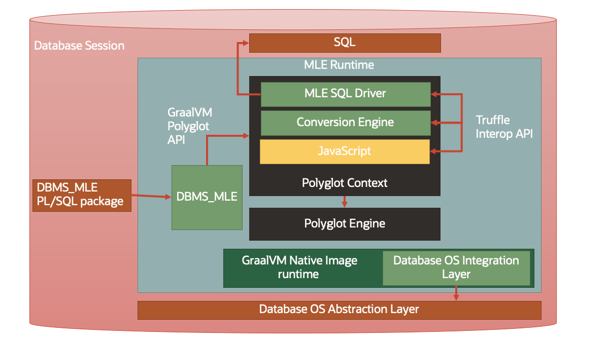
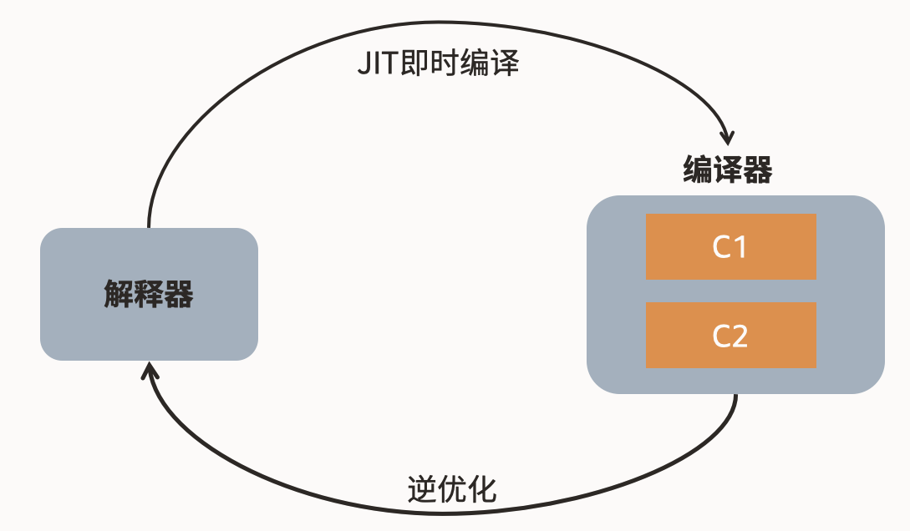
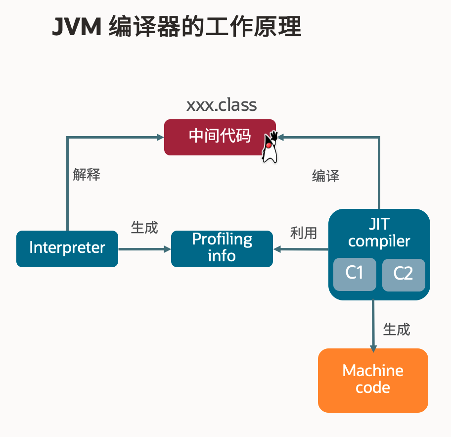
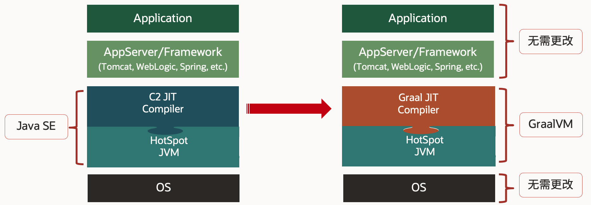
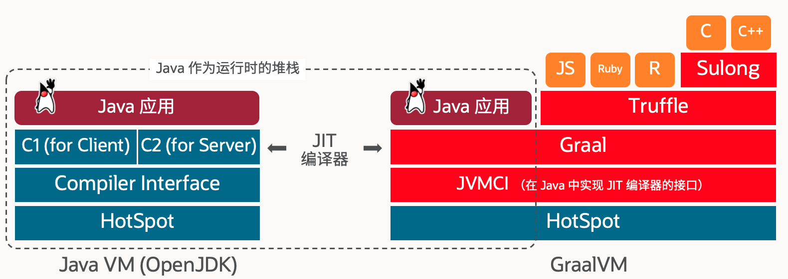
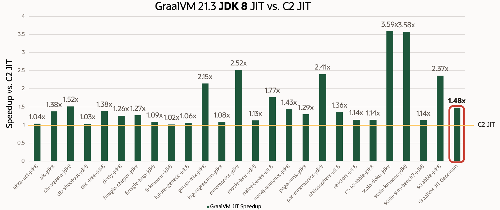
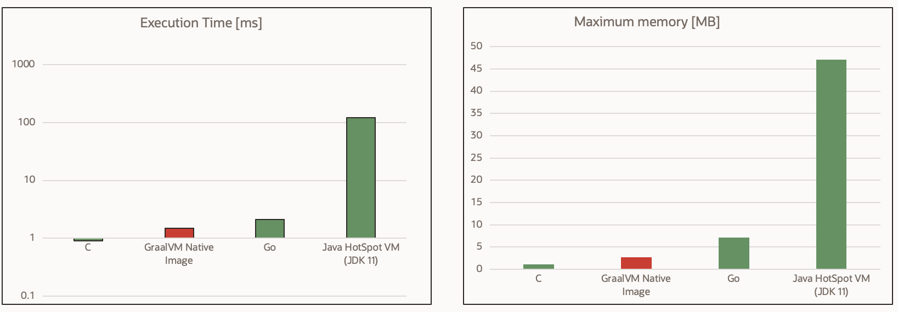
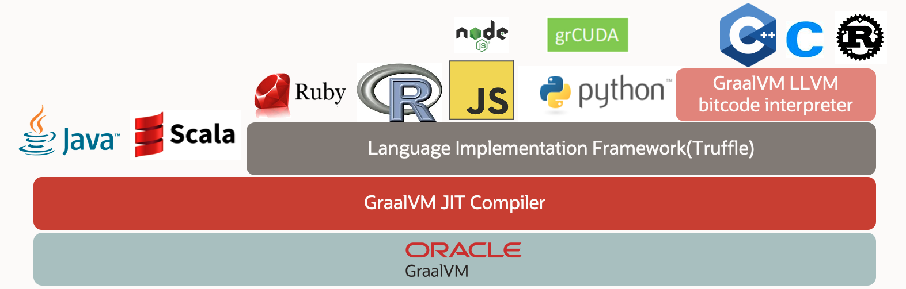
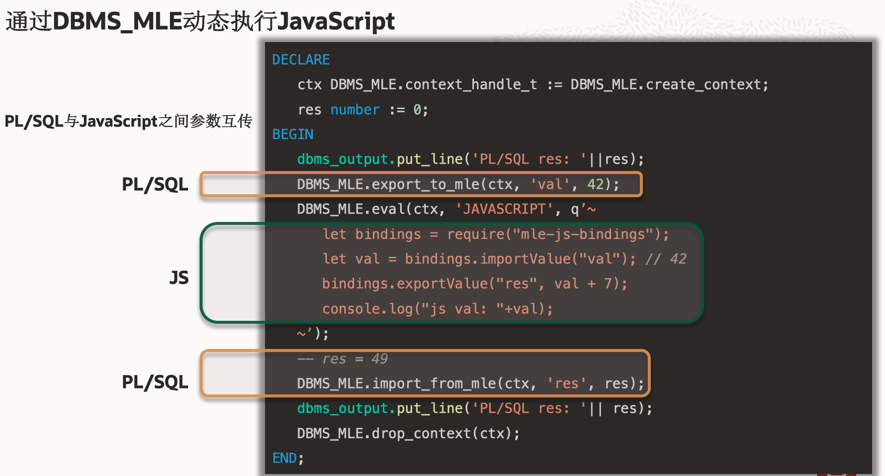

- [引言](#引言)
- [使用MLE多语言在Oracle数据库上的开发实操](#使用mle多语言在oracle数据库上的开发实操)
  - [MLE是什么？](#mle是什么)
  - [GraalVM是什么？](#graalvm是什么)
  - [MLE实操](#mle实操)

# 引言

今天我们一起来聊聊在Oracle数据库上，使用多语言进行Web应用的开发。

内容将分为以下三部分：

1. 使用MLE多语言在Oracle数据库上的开发实操。涉及MLE、GraalVM
2. 如何在APEX上使用MLE进行Web应用的开发实操。涉及免费的低代码平台APEX
3. APEX + MLE的实际用例演示

# 使用MLE多语言在Oracle数据库上的开发实操

## MLE是什么？

Oracle 数据库以支持丰富的编程语言生态而闻名，最常见的服务器端编程接口是PL/SQL。通过使用PL/SQL，可以将业务逻辑和数据保持在一起，除了提供统一的数据处理模式之外，通常还可以显著提高效率。

借助Oracle 21c数据库推出的MLE多语言引擎(Multlingual Engine)，您可以利用PL/SQL来实现JavaScript模块，开发人员还可以选择通过动态执行或通过持久性MLE模块直接存储在数据库中。

> <span style="color:grey;font-size:small;">*持久性MLE模块是Oracle 23c以上支持*</span>

**为什么我需要在数据库端来执行处理呢？**

数据库可以被当作成熟的处理引擎，而不是简单的持久层或简单的REST API，利用数据库就地处理数据可以提供许多优势，例如增强安全性、潜在消除网络往返以及由于使用引用完整性而提高数据质量，而且数据库服务器通常比服务于应用程序前端的机器更强大，从而进一步加快处理时间。

随着要处理的数据量不断增加，尤其是批处理，将大量数据从数据库传输到客户端可能会出现问题，原因如下：

- 服务器之间数据库信息的传输非常耗时，并且可能会导致大量的网络开销
- 延迟通常会显著增加；累积效应可能非常明显，特别是对于那些对话式应用程序
- 在中间层或客户端处理大量数据需要这些环境配备大量DRAM和存储，从而增加成本
- 由于固有的安全风险和数据保护要求，机器之间的数据传输，尤其是在云环境中，通常受到监管控制

而直接在数据库中处理数据是缓解许多此类问题的常见策略

下面是MLE的实现原理架构图，通过PL/SQL的**DBMS_MLE**包来实现多语言的执行，可以看到MLE是基于GraalVM的


## GraalVM是什么？

随着云原生浪潮的兴起，越来越多的应用被部署在了云厂商的云服务环境中，以计算资源的形式为用户提供服务。在这种趋势下，对应⽤快速启动、即起即⽤和⾼性能执⾏的需求越来越强。Java程序的冷启动问题在这种场景下就显得格外突出，成为开发人员在选择编程语言时的减分项。但是，因为Java的冷启动问题的根源在于JVM本身，所以在JVM之上做的各种优化的效果都是有限的，难以实现质的飞跃，很难达到理想的效果。

GraalVM 起始于 2011 年 Oracle 实验室的一个研究项目。该项目旨在创建一个可以杰出性能运行多种编程语言的运行时平台，如下所述，其核心是高级优化 GraalVM 编译器。GraalVM 编译器可用作 Java 虚拟机的即时 (JIT) 编译器，或帮助 GraalVM本地镜像提前将Java字节码编译为原生机器码。

Oracle推出的开源高性能多语言运行平台项目GraalVM，打造了一个包括静态编译器和轻量级运行时的Java静态编译框架，可以将Java程序从字节码直接编译为本地可执行应用程序。与在JVM下执行相比，静态编译后的Java程序的启动速度能以数量级方式提升，完全解决了冷启动的问题，实现了Java应用程序的启动性能的质的突破

**Graal是使用Java重新实现的JIT编译器**

我们知道Java是一次编写，到处执行，是通过JVM的运行时来实现的，JVM屏蔽了各平台的差异，从而允许在任何平台上运行Java应用。

而JVM使用两种方法运行类文件：**解释器**和**JIT编译器**

- <strong style="text-decoration: underline;">解释器</strong>：单个语句翻译成机器代码是由语言处理器完成的，并在进入下一行之前立即执行
- <strong style="text-decoration: underline;">编译器</strong>：编译器将字节码转换为机器语言并执行来提高Java应用程序的性能



> <span style="color:grey;font-size:small;">*当程序需要快速启动和执行的时候，解释器可以首先发挥作用，省去编译的时间，立即执行。在程序运行后，随着时间的推移，编译器逐渐发挥作用，越来越多的代码被编译成本地代码，可以获取更好的执行效率。解释器比较节约内存，编译器的效率比较高*</span>

---

使用JIT（Just In Time）编译器又分为两种：

- **C1客户端**：快速编译方法，快速启动和较小的内存占用比稳态性能更重要，但生成的机器代码不如服务器编译器优化，更注重启动速度和局部的优化
- **C2服务器**：通常需要更多的时间（和内存）来编译相同的方法，但会生成比C1生成的代码更好的优化机器代码，稳态性能比快速启动更重要
  

> <span style="color:grey;font-size:small;">*C1编译器允许大多数应用程序启动得更快（因为编译开销较小），但一旦应用程序达到稳定状态（已预热），C2服务器编译器就会提供更好的运行时性能*</span>

而GraalVM是从JVM内部将C2 JIT编译器替换为新的Graal JIT编译器




---

而GraalVM拥有更好的性能，无需预热，更快、更轻、更省内存



同时，通过Graal编译器与Truffle语言实施框架和Sulong相结合，共同协作，以卓越性能运行JavaScript、Python、R、Ruby 以及LLVM支持的其他等语言


话题回到MLE，也就是说，MLE让Oracle数据库真正意义上的实现了对多语言的支持，意味着你不仅仅能在Oracle数据库上运行SQL或PL/SQL，还可以运行Javascript、Python等等其它语言

## MLE实操

随着Oracle 数据库多语言引擎( MLE )的引入，JavaScript 添加到了数据库中。JavaScript 的加入承认了该语言的流行，并为服务器端数据库开发开放了其广泛的生态系统。

借助MLE，您可以使用 JavaScript 生态系统中可用的习惯用法和工具，以及直接在数据库中部署和使用流行存储库（例如 Node Package Manager (NPM)）中的模块。此外，您可以在应用程序层之间移动，为处理不同工作负载的团队提供更大的灵活性。大量的 JavaScript 人才可以为现有和即将开展的项目提供帮助

下面我们就来实操体验一下，以一个JavaScript的hello world为例：

```sql
DECLARE
   ctx DBMS_MLE.context_handle_t := DBMS_MLE.create_context();
BEGIN
   DBMS_MLE.eval(ctx, 'JAVASCRIPT', q'~console.log("Hello, World!");~');
   DBMS_MLE.drop_context(ctx);
END;
/
```

+ 简单的代码，就三步：
  - 创建JS执行上下文
  - 在当前上下文中，执行JS代码
  - 清除JS上下文

那如果要传递参数该如何做呢？

```sql
DECLARE
    ctx DBMS_MLE.context_handle_t := DBMS_MLE.create_context;
    res number := 0;
BEGIN
    dbms_output.put_line('PL/SQL res: '||res);
    DBMS_MLE.export_to_mle(ctx, 'val', 42);
    DBMS_MLE.eval(ctx, 'JAVASCRIPT', q'~
        let bindings = require("mle-js-bindings");
        let val = bindings.importValue("val");
        bindings.exportValue("res", val + 7);
        console.log("js val: "+ val);
    ~');
    -- res = 49
    DBMS_MLE.import_from_mle(ctx, 'res', res);
    dbms_output.put_line('PL/SQL res: '|| res);
    DBMS_MLE.drop_context(ctx);
END;
```


也就是通过

```sql
    /* 在PL/SQL中，设置val的值到MLE的JS上下文中 */
    DBMS_MLE.export_to_mle(ctx, 'val', 42);
    /* 在PL/SQL中，从JS上下文中导入res的值取出 */
    DBMS_MLE.import_from_mle(ctx, 'res', res);   
```

```js
    /* 在JS中，引入val参数 */
    bindings.importValue("val");
    /* 在JS中，设置res的值导出到PL/SQL中 */
    bindings.exportValue("res", val + 7);
```

更多内容请参考 [JavaScript Developer&#39;s Guide开发者手册](https://docs.oracle.com/en/database/oracle/oracle-database/23/mlejs/index.html)

确实可以在数据库端来执行JS了，但似乎用起来并没有想象中那么的简单，还是有一些代码包裹方面的工作😅

作为一个JS开发者，开发体验能否再好点呢？答案是： <strong>当然！</strong>✌️

先带着这个疑问，我们下期接着聊...😁

<style>
tr:nth-child(even) {
  background-color: #f6f8fa;
}
td{
    min-width: 110px;
}

</style>
