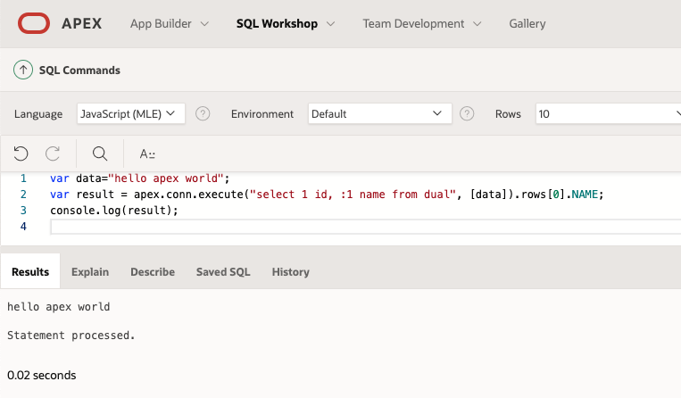

- [如何在APEX上使用MLE进行Web应用的开发实操](#如何在apex上使用mle进行web应用的开发实操)
  - [APEX是什么？](#apex是什么)
  - [MLE跟APEX又是什么关系？](#mle跟apex又是什么关系)
  - [在APEX的SQL Workshop中执行JavaScript代码](#在apex的sql-workshop中执行javascript代码)
  - [如何在APEX应用中使用MLE JavaScript呢？](#如何在apex应用中使用mle-javascript呢)
  - [为什么需要在服务端执行JavaScript？](#为什么需要在服务端执行javascript)
  - [如何在APEX中使用第三方JS Module呢？](#如何在apex中使用第三方js-module呢)

# 如何在APEX上使用MLE进行Web应用的开发实操
上一期我们介绍了Oracle数据库中的多语言引擎MLE。MLE JavaScript与开发Web应用的APEX搭配在一起，能更好的发挥出MLE的特点，让JavaScript开发者更大的受益！

## APEX是什么？
Oracle数据库已经是一款强大的融合型数据库，不但能处理关系型、⾮关系型(JSON/XML)、空间(Spatial)、图(Graph)的数据存储及处理外，简单易用的Oracle Text可以轻松解决搜索需求，本身Oracle数据库还可以直接用来做Web应用开发哦！是的，没听错！一款永久免费的低代码平台Application Express，简称APEX，让数据库直接面向了开发者，构建企业应用速度提高20倍，代码减少100倍！这是Oracle一步一步走进开发者的战略。并且这不是发生在最近。用Oracle数据库就可以做Web应用开发这件事，早在19年前的2004年就开始了～时至今日，APEX已被全球广泛使用，以4.8分的最高分拿下2022年Gartner Peer Insights的最值得推荐的低代码平台，是唯一拥有70%以上5星记录的厂商，没有什么比客户的认可更有说服力了！


如果你还不了解这款宝藏级的低代码开发平台APEX，可以去到[APEX网官](https://apex.oracle.com/zh-cn/)了解更多。官网上只需几分钟，通过邮箱就可以申请一个试用工作区，从而帮助您快速验证APEX的各项功能和能力是否适用。

---

## MLE跟APEX又是什么关系？

了解APEX的朋友们都知道，APEX的开发门槛很低，只需要SQL或PL/SQL就能做开发，只通过一句简单的

```sql
select * from your_table
```

您就能瞬间拥有对这张表的增删改查能力，所有APEX的开发都是直接进行业务逻辑的开发，简单粗暴，也不需要在框架上浪费时间，所以这也是APEX开发效率⾼的原因之⼀。当然，如果要开发一个To C的应用，需要在UI/UX上做的好看些，或是要做扩展引入一些第三方的JS开源库时，那么前端的技术栈，HTML/CSS/JavaScript那些的，还是免不了需要的。总体来说，只要具备PL/SQL和HTML/CSS/JavaScript这些市面上基本又成熟的技术时，你就是一个APEX的全栈开发者了，一个人通过APEX开发出一整套复杂的应用系统，是常有的事。

说到全栈，又让人想到JavaScript了，嗯～JavaScript的风一直都没有退过，特别从NodeJS后，JavaScript一统前后端的格局被打开，全栈一词也开始被频频率提起。对JavaScript开发者来说，APEX确实是非常容易上手的利器，只是对于没那么熟悉PL/SQL，虽然学习门槛不高，但也总归需要点时间熟悉下，若能直接在服务端执行JavaScript，岂不更好？

通过MLE能在服务端执行JavaScript，而APEX又是基于Oracle DB的，那么APEX支持能在服务端执行JavaScript也就是理所应当的事了！


事实是，在APEX中执行服务端JavaScript是相当丝滑的体验，因为APEX中直接原生支持JavaScript了！！

还是从JavaScript的hello world开始，对比看看，在APEX中如何执行呢？

## <span id="APEXSQLDRIVER">在APEX的SQL Workshop中执行JavaScript代码</span>

APEX自带的SQL Workshop可以执行PL/SQL代码


现在Language的下拉则多了一个选项：**JavaScript(MLE)**
无疑随着MLE将支持更多语言，以后的APEX也相应可以支持更多的作为开发语言<br/>


上面只是一个简单的hello world，如果我们需要使用数据库查询的返回时呢？
直接通过**apex.conn.execute**就可以来执行sql语句，返回的结果则放在rows的数组中，例如：

```js
var result = apex.conn.execute("select 1 id, '哈测试' name from dual").rows[0].NAME;
console.log(result);
```


那么，在执行sql时，我又如何将我MLE中的JS的值作为参数传过去呢？
例子如下，**apex.conn.execute**的第二个参数就是入参数组
```js
var data="hello apex world";
var result = apex.conn.execute("select 1 id, :1 name from dual", [data]).rows[0].NAME;
console.log(result);
```



当然，apex.conn.execute也是可以执行PL/SQL的

```js
var data="hello apex world";
var result = apex.conn.execute("begin dbms_output.put_line('hello world'); end;");
console.log(JSON.stringify(result));
```

## 如何在APEX应用中使用MLE JavaScript呢？
在APEX中，将Input字符串实现一个反转reverse的操作，结果输出到Output中进行展现

以往在APEX中可能直接在PL/SQL的Process中实现，即正常页面Submit提交以后，在执行的服务端PL/SQL操作中实现，也可以通过Dynamic Action动态操作来实现AJAX调用执行PL/SQL，不管有没有使用AJAX，本质还是通过PL/SQL来实现的

```SQL
select reverse(:P10_PROCESS_INPUT)
  into :P10_PROCESS_OUTPUT
  from dual;
```


而现在如果在APEX中想使用MLE JavaScript，只需要将Language选择JavaScript(MLE)即可直接写JavaScript了，非常方便直观，使用感也很丝滑，不需要做上下文的处理等工作，不需要书写任何的包裹代码，依旧是APEX的风格：**简单粗暴，直接关注业务逻辑！！**

```js
apex.env.P10_PROCESS_OUTPUT = apex.env.P10_PROCESS_INPUT.split('').reverse().join('');
```


从以上代码也可以看到，APEX通过使用**apex.env**来大大简化了与MLE JavaScript之间的参数传递等工作

还记得我们前面介绍过的MLE传递参数的例子吗？此时将入参输出替换成P1_INPUT和P2_OUTPUT的话，在数据库端通过DBMS_MLE包来独立运行MLE JS的代码也就是如下：
```SQL
DECLARE
    ctx DBMS_MLE.context_handle_t;
    user_code varchar2(1024) := q'~
        let bindings = require("mle-js-bindings");
        let input = bindings.importValue("P1_INPUT");
        bindings.exportValue("P2_OUTPUT", input + 7);
    ~';
BEGIN
    ctx := dbms_mle.create_context();

    dbms_mle.export_to_mle(ctx, 'P1_INPUT', P1_INPUT);
    dbms_mle.eval(ctx, 'JAVASCRIPT', user_code);
    dbms_mle.import_from_mle(ctx, 'P2_OUTPUT', P2_OUTPUT);

    dbms_mle.drop_context(ctx);
END;
/
```


但通过**apex.env**在APEX中调用时则变成只需要如下一句即可：

```js
apex.env.P2_OUTPU = apex.env.P1_INPUT + 7
```

Yes~! 这才是面向JS开发者的体验嘛，真的是太方便了！👍


并且对MLE JavaScript的支持贯穿在APEX每个执行角落，不管是页面Submit提交以后的Process里，还是在Dynamic Action的动态操作中，只要支持PL/SQL的地方，Language就会有MLE JavaScript的选择


## 为什么需要在服务端执行JavaScript？
一切都看着很美好，但也许习惯了只在客户端使用JavaScript的朋友们不禁会来个灵魂拷问：到底什么样的场景下我需要在服务端执行JavaScript呢？有很多已经在客户端执行很多年了，似乎也没有什么问题呀❓

+ 为什么在服务端来执行JavaScript更好，原因如下：
  - <span style="text-decoration: underline;">**服务端执行JavaScript更安全！**</span>
    这点不需要多说，相信大家都懂，JavaScript在客户端运行的安全性一直是JS的弱项一般的存在，而如果能在服务端执行JS，安全性大大提高，弥补了长久以来的安全性弱点。<br><br>
  - <span style="text-decoration: underline;">**解锁了更多的使用场景**</span>
    比如，就以今天后面会跟大家展示的示例来说，在服务端生成二维码时，就可以实现在文档中嵌入二维码、在服务端发邮件时发送二维码图片等等。那些仅凭客户端无法做到的，现在都可以了✌️<br><br>
  - <span style="text-decoration: underline;">**与其它平台对接选择更多了**</span>
    在做一些集成的时候，一般可能会提供一些常见语言的SDK，JS往往是其中之一，但一般不会提供PL/SQL的SDK，于是常常要在客户端来做这些实际是基于服务端的集成，并不合适也不安全。再比如，一些加密算法，也存在会提供主流开发语言的，但可能没有PL/SQL的，<span style="display:none;">但如果有些SDK中包含一些HTTP请求，那么仅在客户端执行，可能会遇到跨域等问题，以往遇到此情况我们可能通过代理、单独再启个服务端、甚至改写成PL/SQL等各种方式来曲线救国了。</span>而现在这些就都可以直接在服务端运行了，集成变得更容易了！<br><br> 


## <span id="useModule">如何在APEX中使用第三方JS Module呢？</span>
作为一个JavaScript开发者，经常是以Module的方式来引入JS库的，那么这些第三方的JS Module如何在APEX中引入呢？

首先，Module需要管理，包括获取、存储、下载等等，然后就是Module在JS中的引入及调用

可以使用数据库原生提供的持久性MLE Module来管理Module
官方文档见[引入MLE JavaScript Modules](https://docs.oracle.com/en/database/oracle/oracle-database/23/mlejs/overview-importing-mle-js-modules.html#GUID-B10ABCEF-7E1C-4575-A326-325F1FE3D17D)

大概的步骤有如下几步：
1. <span id="createModule">**数据库端通过PL/SQL创建MLE Module**</span>
比如叫*named_exports_module*
```sql
CREATE OR REPLACE MLE MODULE named_exports_module LANGUAGE JAVASCRIPT AS
function sum(a, b) {
    return a + b;
}
function difference(a, b) {
    return a - b;
}
export {sum, difference};
/
```
如果创建的module要引入其它依赖的module时，可以用import引入
比如以下例子，引入的namedExports，是在后面[第2步](#createENV)中定义的环境变量的JS引入名，后面步骤中也会看到如何映射这个namedExports与其所对应的MLE Module
```SQL
create OR REPLACE MLE module jsmodule LANGUAGE JAVASCRIPT 
As
    import * as myMath from "namedExports";

    export function mySum(a, b) {return myMath.sum(a,b+10);}
    export function myDiff(a, b)  {return myMath.difference(a,b);}
/
``` 


2. <span id="createENV">**创建MLE Module的环境变量。** </span>
这一步主要是建立上一步所创建的Module和在JS要引入名之间的映射关系，一个环境变量可以包含有多个Modules


PL/SQL创建脚本为
```sql
CREATE OR REPLACE MLE ENV xh_exports_env
    imports ('namedExports' MODULE named_exports_module, 
             'jsModule' MODULE JSMODULE);
```

3. <span id="sessionENV">**JS代码引入MLE Module，并指定是使用哪个#2步中所创建的MLE Module的环境变量**</span>
   - 如果是在APEX的SQL Commands中，则直接在Environment的下拉中选择即可
   
   
   - 如果是要在APEX的某个具体应用里面的Process等处理中使用时，先在 <span style="text-decoration: underline;">*Shared Components > Security Attributes > Database Session (section) > MLE Environment*</span> 中设置好使用哪个MLE Module的环境变量，只能选一个
   
   
4. <span id="mleProcess">**最后就可以直接在Process里面引入了** </span>
   ```js
   const {sum, different} = await import("namedExports");
   apex.env.P4_JS_OUTPUT = sum(7, 8);
   ```

当然，不使用持久性MLE Module，你也可以在APEX这边直接自己建一个存放Module的表，用来实现对Module进行自定义的管理、加载等工作，如果你想了解如何自定义实现，可以参考这个[APEX+MLE Demo](https://github.com/stefandobre/apex-mle-demo)，结合上面原生持久化MLE Module的介绍，你可以试着来将其改写成使用原生持久化MLE Module的方式😎，如果尝试过了还不知道怎么做，没关系～下期也会给出参考答案

下一期，我们就来介绍几个APEX + MLE的实际用例演示


