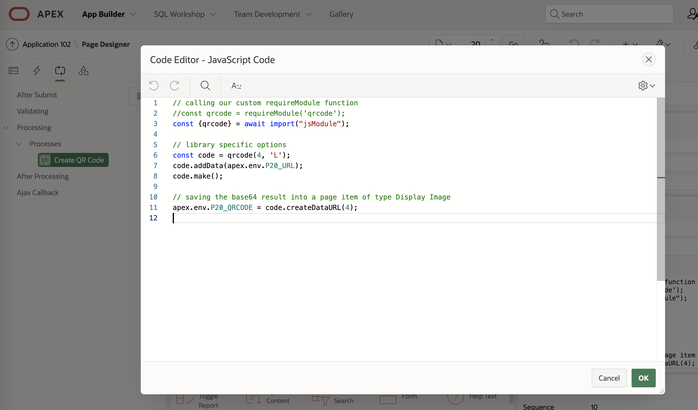
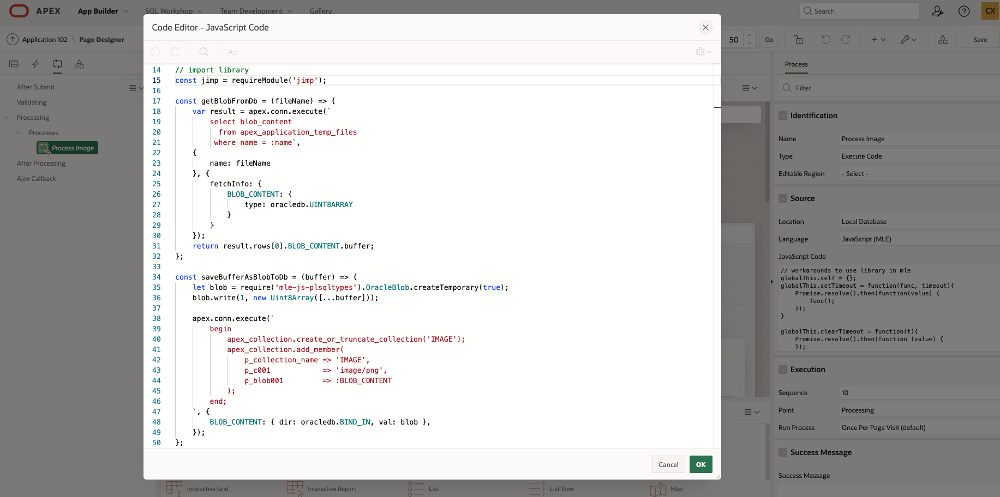

- [APEX + MLE的实际用例演示](#apex--mle的实际用例演示)
    - [1.  表单提交前的校验](#1--表单提交前的校验)
    - [2. 二维码生成](#2-二维码生成)
    - [3. Markdown转HTML](#3-markdown转html)
    - [4. HTML过滤器](#4-html过滤器)
    - [5. 图片处理](#5-图片处理)
    - [6. 情感分析](#6-情感分析)
- [学习资料，一起来动手实践吧](#学习资料一起来动手实践吧)

# APEX + MLE的实际用例演示

前两期我们已经就 **MLE** 以及 **如何在APEX上使用MLE进行Web应用的开发**进行了介绍，虽然APEX本来就是JS兼容扩展的，但以前仅限客户端，现在服务端上也可以进行JS扩展了

现在，面对广袤的JS市场，您可以自由发挥了👏😊，今天就借着[APEX+MLE Demo](https://github.com/stefandobre/apex-mle-demo)来分享几个MLE JavaScript在APEX中的用例


示例中所用到的js库见如下列表

|              用例名              |  用到的JS库  | URL                                                                                    |
| :------------------------------: | :-----------: | :------------------------------------------------------------------------------------- |
|             表单校验             |   validator   | https://cdnjs.cloudflare.com/ajax/libs/validator/13.5.2/validator.min.js               |
|            生成二维码            |    qrcode    | https://cdnjs.cloudflare.com/ajax/libs/qrcode-generator/1.4.4/qrcode.min.js            |
|          Markdown转html          |    marked    | https://cdnjs.cloudflare.com/ajax/libs/marked/1.2.9/marked.min.js                      |
|             HTML过滤             | text-encoding | https://cdn.jsdelivr.net/npm/text-encoding@0.6.4/lib/encoding.min.js                   |
|             HTML过滤             |   mle-jsdom   | https://raw.githubusercontent.com/stefandobre/mle-jsdom/main/jsdom.js                  |
|             HTML过滤             |   dompurify   | https://cdnjs.cloudflare.com/ajax/libs/dompurify/2.2.7/purify.min.js                   |
| 图片处理<br/>水印、剪裁、翻转 |     jimp     | https://cdn.jsdelivr.net/npm/jimp@0.16.1/browser/lib/jimp.js                           |
|             情感分析             | mle-sentiment | https://raw.githubusercontent.com/stefandobre/mle-sentiment/main/dist/mle-sentiment.js |

由于该示例是自己处理Module的管理，而不是使用原生的持久化MLE Module来管理，所以也提供了一个专门管理Module的操作界面，可以使用JS的CDN链接，也可以直接把内容复制粘贴过来


接下来我们就一起来看看这几个MLE APEX示例吧💪

### 1.  表单提交前的校验

Web应用在表单提交以后，会进入到校验的步骤，检验每个字段是否合规等，APEX中就提供了大量的校验规则，有些个性化的、特殊的、针对性较强的场景，也可以自己写PL/SQL来处理逻辑复杂的校验规则，而JS的Validator库就提供了很多针对性的校验，包括信用卡、邮箱是否是有效的等，可以省去自已写的繁琐

可以看到这样的直接在APEX的Validation中使用JS的好处：APEX自带的校验的原生功能都能保留下来，比如错误信息提示、错误字段的关联及高亮等等都能正常显示

代码部分实现的方式如下：


代码很简单，使用很方便👍

但以上的Module并非用原生的持久化MLE Module来管理，而是自己建了一张Module表来处理的，所以requireModule函数是自己定义写好的，代码如下：

```js
const loadFromDatabase = (moduleName) => {
    var result = apex.conn.execute('select content from mle_module where name = :name', {
        name: moduleName
    }, {
        fetchInfo: {
            CONTENT: {
                type: apex.db.STRING
            }
        }
    });
    return result.rows[0].CONTENT;
};

const decorateModule = (module) => `
(function () {
  var exports = {};
  var module = {exports: exports};
  ${module};
  return module.exports;
})();`;

const moduleCache = {};

globalThis.requireModule = (moduleName) => {
    if (!moduleCache[moduleName]) {
        const moduleString = decorateModule(loadFromDatabase(moduleName));
        moduleCache[moduleName] = Polyglot.eval('js', moduleString);
    }
    return moduleCache[moduleName];
};
```

这种⽅式灵活度⾼，但⾃⼰管理也就要多出类似以上部分的代码，虽然可以帮助我们更好的理解整个Module的
运作情况，我们当然可以将其改为直接使⽤原生持久化的MLE Module管理⽅式，这样自己写的代码也就少了很多，不用重复造车轮子了

具体方法也就是参考上一期文章中的 [如何在APEX中使用第三方JS Module](#useModule)，大概的步骤如下：

1. [建MLE Module](#createModule)，不想使用上面介绍的PL/SQL方式，也可以直接通过APEX的界面来添加，直接到 *APEX的SQL Workshop -> Object Browser -> 左边的下拉列表* 里选择，同样这里还可以进行后面步骤2中MLE Environments环境变量的管理，用户体验更友好👍
   

   先将代码包裹成标准的js module形式，以validator为例：

   ```js
   export var validator = (function () {
   var exports = {};
   var module = {exports: exports};
       ...第三方JS库，此处则为validator.min.js的内容...

       return module.exports;
   })();  
   ```

   最后生成好的validator的MLE Module如下：
   
   
2. [创建MLE环境变量](#createENV)，或在已有环境变量中加入这个新的validator的Module，同样也是可以通过APEX的界面操作。
   我是直接在XH_EXPORTS_ENV这个MLE JS环境变量中加了个新的validator的Module，结果如下：
   
3. [在APEX的Application上指定要引入哪个MLE环境变量](#sessionENV)，此时则指定XH_EXPORTS_ENV这个我自建的环境变量
   
4. MLE Module和Environment都准备好，最后[代码改动](#mleProcess)就很简单了
   将原来的

   ```js
   requireModule('validator').isEmail(apex.env.P15_EMAIL)
   ```

   改为如下就可以了

   ```js
   (await import("validator")).validator.isEmail(apex.env.P15_EMAIL)
   ```

   

那么后续的几个示例的改法也是依法炮制，也就不再赘述了，直接来看下示例的效果吧

### 2. 二维码生成

二维码的JS库很多，随便找一个qrcode包
    
    后台生成好二维码以后生成image url返回前端展示图片，当然也可以改成后台直接将图片保存进类型为BLOB的字段
    

### 3. Markdown转HTML

将Markdown格式转成HTML，点转换，左边输入markdown后点Convert转换按钮后，右边则出现对应的HTML代码，效果如下
    
    代码实现如下：
    
    有没有发现所有的都挺类似的，是的，就是这么简单啊，JS开发者们现在该笑了吧😬

### 4. HTML过滤器

这个HTML过滤器也是非常常用的一个JS库，特别对于有些富文本的编辑内容最终是以HTML的源代码存入到数据库中，这些HTML主要是保留内容的样式，对于JS应该直接过滤掉，不然这时候嵌入一些恶意的或是不合适的JS代码就不好了，所以可以通过dompurify这个JS库来进行HTML的过滤后再存入。
那么实现的效果如下：
如果没有使用该HTML过滤器时，可以看到，所有的JS代码都被保留下来了，点击链接也会收到弹出提示
    
但如果我把打开过滤器后，这段JS代码就被直接过滤清除掉了


代码部分如下：


可以注意到在这个示例里，除了使用到dompurify库外，还有额外使用到另两个text-encoding 和 mls-jsdom

### 5. 图片处理

通过JS的图象处理库jimp，可以对图片进行一些简单的处理，比如加上水印、按大小进行裁剪、翻转等等


代码实现如下：
相关函数的封闭定义

主体代码实现逻辑如下


主要的实现逻辑是：

1. 上传的文件，APEX会存放在apex_application_temp_files的缓存对象里，先通过getBlobFromDb将图片以BLOB形式取出来，如果是要加水印的，就存放在自定义名叫blobs的map中 <br><br>
2. 然后交给jimps去进行处理，如果有剪裁方面的需要，通过apex.env.P50_CROP_X、apex.env.P50_CROP_Y、apex.env.P50_CROP_WIDTH、apex.env.P50_CROP_HEIGHT等拿到入参即可，同样如果有翻转的需要，通过apex.env.P50_FLIP来获取到APEX界面上的输入 <br><br>
3. 最后通过jimps处理好后的图片，再通过saveBufferAsBlobToDb将数据存回自定义名为IMAGE的collection(Session缓存中)，以便在前端进行展示结果使用，当然你也可改成存入指定数据库的某张表中进行待久化

### 6. 情感分析

一个做情感分析的JS库，在分析用户评价时经常会用到的，如果分析到正面情绪就给出大于0的正分，如果是分析成是负面情绪的，则会结出小于0的负分，中性的则是0分


代码部分也相当简单

```js
loadScript('mle-sentiment');

var sentiment = new globalThis.Sentiment;
var result = sentiment.analyze(apex.env.P70_CONTENT);

apex.env.P70_RESULT = result.score;
```

示例中的这个库主要支持英文，当然，您如果有更好的支持中文情感分析的JS库，也不妨可以一试哦👌，但也别忘了Oracle DB原生就支持很多强大的AI功能：各类回归分析、分类、异常处理、情感分析等都是有的，虽然那些是基于PL/SQL的，JS开发者们还是可以通过 [apex.conn.execute执行执行PL/SQL代码](#APEXSQLDRIVER)来使用，毕竟条条大路通罗马，MLE带给我们的好处就在此，多样性多种选择，同时也可以取各家之所长为已用，不必拘泥，谁有好的就用谁的，JS有好的就用JS的，PL/SQL有好的就用PL/SQL的，以后会支持更多的语言，比如万能脱水语言Python等，更多的大数据分析的库等着我们可以享用，有没有很期待😁

# 学习资料，一起来动手实践吧

这么长的文章，能看到这儿的，说明你已经对APEX+MLE多少有点感兴趣了😜 ，那么是不是有种跃跃欲试的感觉，这里附上[APEX + Server-Side JavaScript hands-on资料](https://shlayel.github.io/oracle-livelabs-apex/mle-javascript/index.html)，这个资料就是直接用原生的持久化MLE Module来实现的，您可以跟着上面一步步的说明一起来动手尝试下吧✌️！


